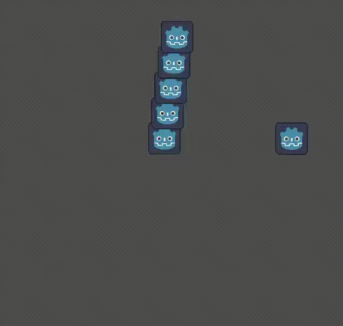

# Simple Node2D Movement

This example shows how to move a Sprite2D around the screen.

It demonstrates how to:
- Add systems to the _process loop.
- Add components to entities that are Godot nodes.
- Access _process delta time.
- Modify the position of Node2Ds.

## Running This Example

1. **Build**: `cargo build`
2. **Run**: You can either:
    1. Open the Godot project and run the scene
    1. Run: `cargo run`. NOTE: This requires the Godot binary, which we attempt
       to locate either through your environment's path or by searching common
       locations. If this doesn't work, update your path to include Godot. If
       this fails for other reasons, it may be because your version of Godot
       is different than the one the example was built with, in that case,
       try opening the Godot project first.
